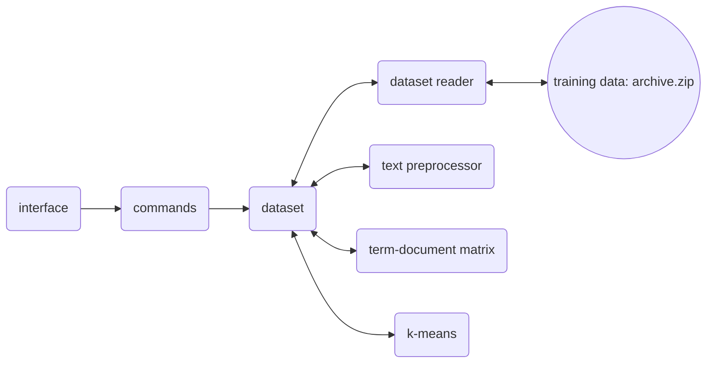

# Implementation Document

## Structure

The startup and imports are done by app.py. After that the structure of the app follows the graph. Interface and commands are responsible for printing and getting the information to and from user. Dataset is the center of this app. It acts as a cache and sends requests to other files, which in turn do all the hard work and return the results back to dataset.

## Achieved Time and Space Complexity

The time complexity of TF-IDF is O(nL log nL), where:
- n is total number of documents in a dataset
- L the average length of a document

The space complexity of TF-IDF:
- First the dataset is read into a list. There are 2224 text documents in the "archive.zip". The space complexity is O(M * L), where M is the number of documents and L is the average length of a document.
- Term-Document Matrix: The space required to store this matrix depends on the number of unique words and the number of documents. The space complexity of the matrix is O(N * M), where N is the number of unique terms and M is the number of documents.
- Inverse Document Frequency: The IDF component of TF-IDF involves calculating the inverse document frequency for each word. This requires storing the IDF value for each word in a matrix. The space required for the IDF values is O(N * M).
- Another TF-IDF matrix is stored of the reduced number of terms. Space comlexity O(N' * M), where N' is the reduced number of unique terms.

The time complexity of k-means algorithm is O(n * k * d * i), where:
- n is number of documents
- k the number of clusters (chosen by user)
- d the number of dimensions (terms) (chosen by user)
- i the number of iterations needed for convergence, which is usually around 10-20 (hard cap chosen by user)

The space complexity of k-means algorithm:
- Centroid coordinates are stored in a matrix of O(N' * C), where N' is the number of (reduced) terms and C is the number of centroids.
- Distances are stored in a matrix of O(M * C), where M is the number of documents.

The rest of the used variables in the codebase are small enough to leave out of this document.

### Running Times

The times have been measured using the "archive.zip" dataset which is located in "datasets" folder.

Name | Time |
-----|------|
Load a dataset | 0.1 s |
Preprocess a dataset | 9.4 s |
Create a term-document matrix | 1.0 s |
Create a TF-IDF matrix | 32.6 s |
Reduce the number of terms | 0.8 s |
Centroid initialization | 0.5 s |
K-means clustering (with 10000 terms, 10 clusters, and 21 iterations) | 42.2 s |
K-means clustering (with 1000 terms, 5 clusters, and 30 iterations) | 4.9 s |
Overall (depending on settings) | 49.3 - 86.6 s |

## Shortcomings and Possibilities for Improvement

- The user interface is, and probably will be very basic and unintuitive.
- Because of the lack of a better interface, the browsing of documents is difficult.
- If the size of the database grows, or the settings given by user are too demanding, at some point the running time will inevitably skyrocket.
- There are more complex, and probably better ways to select the reduced group of terms and the initial centroid locations.
- There are no suggested number of clusters, and the number of clusters will impact the precision of the clustering.
- There are also more complex ways to cluster text documents instead of k-means, such as neural networks.

## Sources

- [Mining Text Data, by Aggarwal, Charu C. editor.; Zhai, ChengXiang. editor](https://helka.helsinki.fi/permalink/358UOH_INST/q5v72t/alma9933476355706253)
- [k-means wikipedia](https://en.wikipedia.org/wiki/K-means_clustering)
- [https://neptune.ai/blog/k-means-clustering](https://neptune.ai/blog/k-means-clustering)
- [An introduction to statistical learning : with applications in R, by James, Gareth (Gareth Michael), author.; Witten, Daniela, author.;Hastie, Trevor, author.;Tibshirani, Robert, author.](https://helka.helsinki.fi/permalink/358UOH_INST/1rnip4l/alma9934192676106253)
- [https://www.cs.helsinki.fi/group/dime/lado/k06/exerc/ex1.html](https://www.cs.helsinki.fi/group/dime/lado/k06/exerc/ex1.html)
- [Training Data](https://www.kaggle.com/datasets/shivamkushwaha/bbc-full-text-document-classification)
